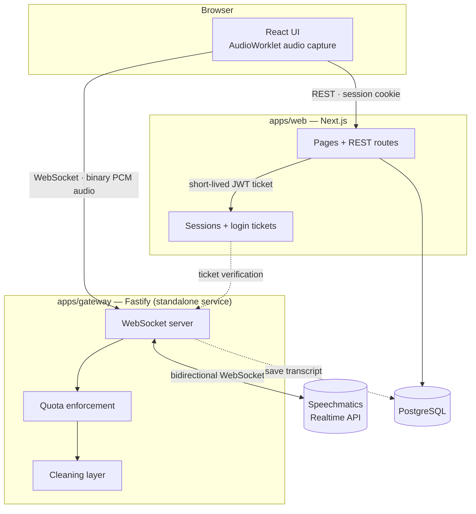

<div align="center">

[العربية](README.md) · **English**

# Sawt (صَوت)

### Live speech-to-text, in the dialect people actually speak — not translated MSA

**تفريغ صوتي حي بلهجتك الحقيقية**


<picture>
  <source media="(prefers-color-scheme: dark)" srcset="docs/screenshots/home-dark.png">
  <source media="(prefers-color-scheme: light)" srcset="docs/screenshots/home-light.png">
  
</picture>

</div>

<br>

> **Note:** the product itself has no English interface — it's built for Arabic speakers,
> and every screenshot below shows the real (Arabic) UI. This file documents the same
> codebase as [`README.md`](README.md) in English for contributors and reviewers; see that
> file for the canonical, primary-language version.

## Overview

Commercial speech-to-text engines do one thing well: turn audio into polished Modern
Standard Arabic. The problem is that most people don't speak MSA — they speak Gulf,
Egyptian, or a mix of Arabic and English inside the same sentence. And even when an engine
does understand the dialect, it hands back raw text full of "um… like… uh" that needs manual
cleanup after every recording.

**Sawt** solves both problems at once: it tunes the recognition engine to the selected
dialect before the user starts talking, text appears on screen **while** they speak rather
than after, and a dialect-aware post-processing layer strips filler words and stutters
automatically — while always keeping the raw text one toggle away, so nothing is ever lost.

## Features

- 🎙️ **Real streaming transcription** — first word appears in under two seconds of speech (streaming, not batch)
- 🗣️ **Four dialects** — Gulf, Egyptian, MSA, and English (with mid-sentence Arabic/English code-switching)
- 🧹 **Context-aware cleaning** — drops "يعني" (_"like"_) when it's filler, keeps it when it's a real verb; never touches a word that might carry meaning
- 📄 **Raw text is never destroyed** — every segment keeps its original alongside the cleaned version, with a permanent toggle between the two
- ⏸️ **Silence becomes structure** — a long pause becomes a paragraph break, not a blank line
- 📁 **File upload** alongside live recording
- 📤 **Multi-format export** — TXT, SRT (with real timestamps), and Word
- 🔐 **Accounts and a transcript library** scoped per user, isolated at the query level
- 🌗 **Dark/light mode** following the system or an explicit user choice
- 🔌 **Swappable STT engine** behind one interface (Speechmatics today; Google/Whisper are ready to plug in)
- 🧩 **A new dialect is one file** — no code anywhere else has a single conditional that knows dialect names

## Screenshots

<table>
<tr>
<td width="50%">

**Cleaned transcript — paragraphs, a removed-filler count, and every export format**


</td>
<td width="50%">

**Recording studio — an amplitude bar meter, not a pulsing orb**


</td>
</tr>
<tr>
<td width="50%">

**Transcript library — scoped per user**


</td>
<td width="50%">

**Dark mode**


</td>
</tr>
</table>

## Tech stack

| Layer             | Choice                                                          | Why                                                                                   |
| ----------------- | --------------------------------------------------------------- | ------------------------------------------------------------------------------------- |
| Frontend          | Next.js 15 · React 19 · Tailwind CSS v4                         | One deployable for UI, REST, and auth; mature RTL support                             |
| Streaming gateway | Fastify · `ws`                                                  | A standalone service holding the engine key; lightweight under concurrent connections |
| Database          | PostgreSQL · Prisma                                             | Full type safety, clear relations between users and transcripts                       |
| Auth              | JWT sessions signed with `jose` (HS256) in an `httpOnly` cookie | No third-party dependency on the most security-sensitive path in the app              |
| Passwords         | `scrypt` from `node:crypto`                                     | Purpose-built for passwords, zero third-party crypto package                          |
| STT engine        | Speechmatics Realtime API                                       | One Arabic model trained across dialects, with Arabic/English code-switching          |
| Typeface          | Alexandria (self-hosted via `next/font`)                        | One variable family covering Arabic and Latin together                                |
| Tests             | Vitest                                                          | The cleaning layer is fully tested with zero network dependency                       |

## Architecture



The streaming gateway is **deliberately a separate service**, because shared hosting
(including Hostinger's base plans) doesn't support long-lived WebSocket connections — its
architecture assumes short-lived processes. Both deployment options (split hosting, or a
single unified VPS) are documented in [`docs/DEPLOYMENT.md`](docs/DEPLOYMENT.md).

## Quick start

```bash
git clone <repo-url>
cd arabic-v2t
pnpm install

cp .env.example .env          # set at least AUTH_SECRET: openssl rand -base64 32
pnpm --filter @arabic-v2t/db generate
pnpm --filter @arabic-v2t/db migrate

pnpm dev                      # web on :3000 — streaming gateway on :4000
```

> **No Speechmatics key?** No problem. When `SPEECHMATICS_API_KEY` is empty, a mock
> provider streams deliberately filler-heavy sample text, so you can see the cleaning layer
> actually working — recording, live streaming, saving, exporting — without spending a
> minute of API time or creating an account.

## Project structure

```
arabic-v2t/
├── apps/
│   ├── web/              Next.js — UI, REST, auth
│   └── gateway/           Fastify — live streaming, STT engines, quotas
├── packages/
│   ├── core/               Dialect registry + cleaning layer (pure logic, no network)
│   └── db/                  Prisma schema
└── docs/
    └── DEPLOYMENT.md        Deployment guide (Hostinger + Railway / unified VPS)
```

## Adding a new dialect

Two steps, nothing else:

**1.** Create `packages/core/src/dialects/levantine.ts`:

```ts
export const levantine: DialectDefinition = {
  id: 'ar-LB',
  label: 'الشامية',
  description: 'لبنان، سوريا، الأردن، فلسطين',
  sample: 'كيفك؟ شو أخبارك؟',
  family: 'levantine',
  direction: 'rtl',
  flag: '🇱🇧',
  engine: {
    speechmatics: {
      language: 'ar',
      operatingPoint: 'enhanced',
      maxDelay: 1.5,
      additionalVocab: ['بيروت', 'كيفك', 'هلق'],
    },
    google: { languageCode: 'ar-LB', model: 'chirp_3' },
    whisper: { language: 'ar', initialPrompt: 'محادثة باللهجة الشامية.' },
  },
  fillers: ['اه', 'امم', 'يعني', 'شو'],
  protectedWords: [{ word: 'شو', keepWhen: /شو\s+(?:أخبارك|بدك|صار)(?![؀-ۿ])/g }],
}
```

_(The Arabic string values — labels, sample phrases, filler words — are real in-app content,
not placeholders. That's what the dialect actually displays and matches against.)_

**2.** Add it to the array in `packages/core/src/dialects/index.ts`.

The selection card in the UI, the engine configuration, and the cleaning word lists are all
derived from the registry automatically. No other code anywhere checks a dialect id.

## Swapping the transcription engine

Implement the `TranscriptionProvider` interface in `apps/gateway/src/providers/` and
register it in `createProvider()`, then set `STT_PROVIDER`. The rest of the project — UI,
cleaning layer, persistence — never knows which engine is running behind it.

**Why Speechmatics first?** Its single Arabic model is trained across Gulf, Egyptian,
Levantine, and Maghrebi dialects together, and supports mid-sentence Arabic/English
code-switching. Alternatives rely on separate dialect locale codes whose output skews toward
MSA, and its streaming cost runs roughly a third of Google's, with 480 free minutes a month
to try it.

## The cleaning layer

A chain of pure functions in `packages/core/src/cleaning/`, each independently testable and
independently toggleable:

| Step              | What it does                                                                                     |
| ----------------- | ------------------------------------------------------------------------------------------------ |
| `normalizeArabic` | Strips elongation and diacritics (hamzas are preserved), normalizes digits, fixes hamza spelling |
| `stripFillers`    | Removes filler words, tolerant of elongation, with contextual exceptions                         |
| `collapseRepeats` | Folds stutters and elongated letters                                                             |
| `segmentByPause`  | Turns long silence into paragraph breaks                                                         |
| `fixPunctuation`  | Cleans up artifacts left by removal and normalizes Arabic punctuation                            |

Two governing principles, never violated:

1. **Nothing is removed unless it carries zero meaning, ever.** "يعني" is dropped as filler
   in "يعني أنا رحت" and kept as a real verb in "هذا يعني أن الأمر انتهى." Egyptian "ايه" is
   protected in question contexts. Words like "طيب," "ماشي," and "like" were never added to
   any filler list at all despite being common filler candidates, because the cost of wrongly
   deleting one is far higher than the cost of leaving it in.
2. **Raw text is never destroyed.** Every segment stores `raw` and `clean` together with a
   list of what was removed and why, and the UI always keeps a toggle between the two views.

## Quality and testing

```bash
pnpm test        # 104 tests across all three packages
pnpm typecheck    # zero errors project-wide
```

- **85** tests in `packages/core` — the cleaning layer and dialect registry, with zero network dependency
- **13** tests in `apps/gateway` — engine result mapping, and quota enforcement
- **6** tests in `apps/web` — password hashing and verification
- **A real time-to-first-word measurement**:
  `pnpm --filter @arabic-v2t/gateway probe ar-BH` pushes synthetic audio over a live
  connection with no microphone required, and prints the time until the first word appears
  (602ms on the last run, against a sub-2-second target)

## Commands

```bash
pnpm dev                                        # run the web app and streaming gateway together
pnpm build                                       # build every package
pnpm test                                        # all tests
pnpm typecheck
pnpm --filter @arabic-v2t/core test              # cleaning layer only — no API key needed
pnpm --filter @arabic-v2t/gateway probe ar-BH    # measure time-to-first-word
pnpm --filter @arabic-v2t/db studio              # Prisma Studio to browse the database
```

## Default limits

Guarding an early-stage deployment against a surprise bill — all overridable via environment variables:

| Limit                  | Value      | Variable                     |
| ---------------------- | ---------- | ---------------------------- |
| Single session length  | 15 minutes | `MAX_SESSION_MINUTES`        |
| Uploaded file size     | 50MB       | `MAX_UPLOAD_MB`              |
| Monthly quota per user | 60 minutes | `USER_MONTHLY_QUOTA_MINUTES` |
| Concurrent sessions    | 2          | `MAX_CONCURRENT_SESSIONS`    |

## Deployment

A full guide covering two options — split hosting (UI on Hostinger, streaming gateway on
Railway, near-zero extra cost) or a single unified VPS container — lives in
[`docs/DEPLOYMENT.md`](docs/DEPLOYMENT.md), including the Nginx WebSocket-upgrade
configuration and a post-deploy checklist.

## Roadmap

- [ ] Implement the Google Chirp and Whisper providers behind the existing interface (the scaffolding exists, the implementation doesn't)
- [ ] Move the quota counter from gateway memory into the database — required before running more than one instance
- [ ] An Expo app consuming the same REST API and streaming gateway
- [ ] Light-model text polishing (disabled by default; the scaffolding already exists in the cleaning layer)

## License

Private project. All rights reserved.
