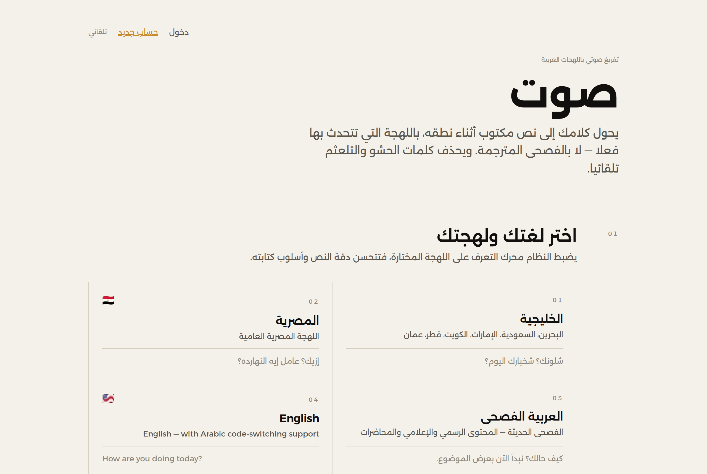
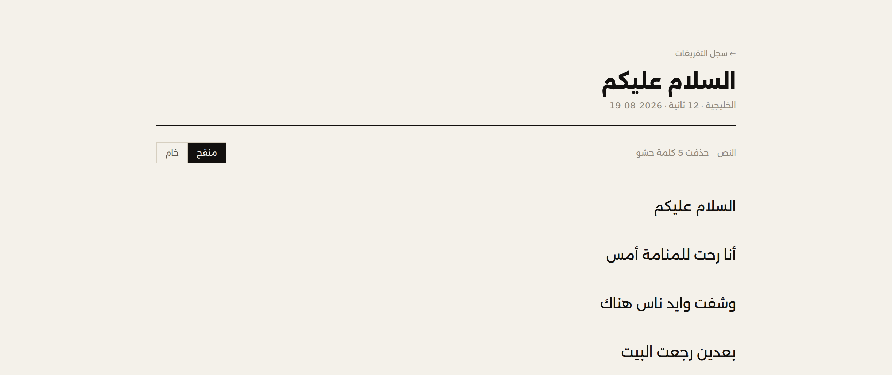
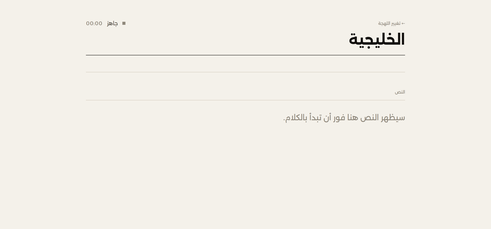
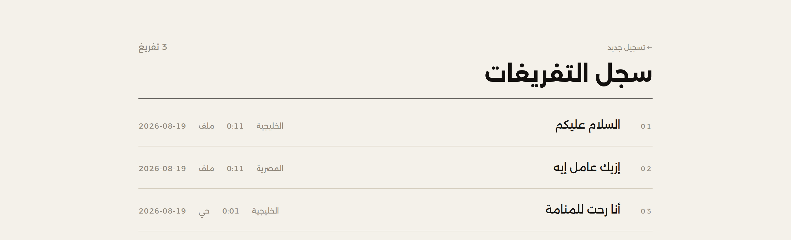
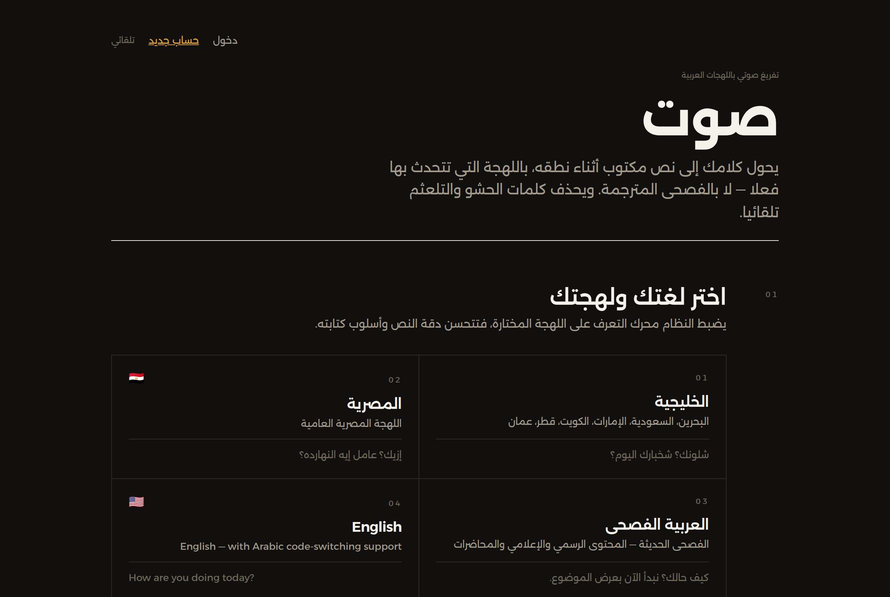
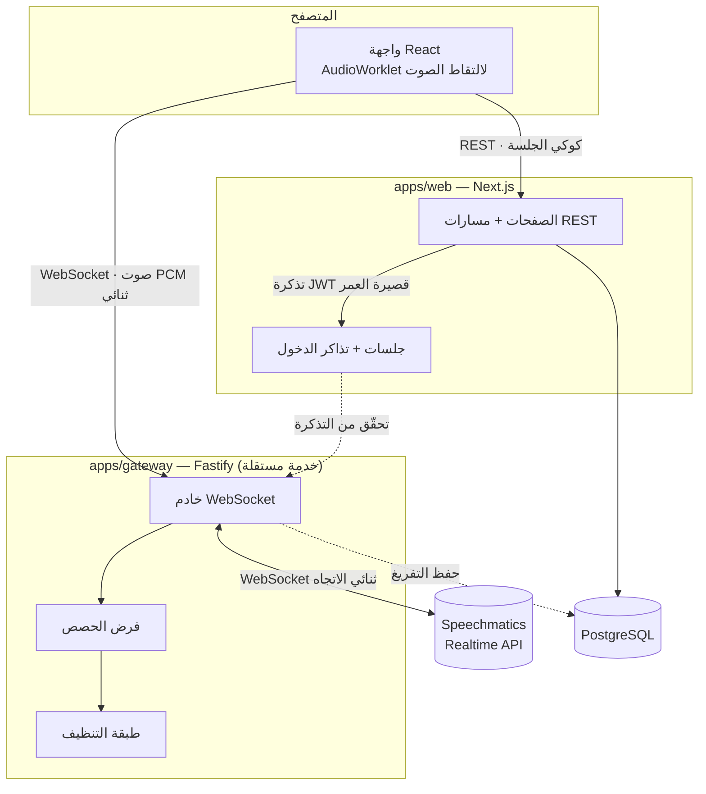

<div align="center">

**العربية** · [English](README.en.md)

# صَوت

### تفريغ صوتي حي، بلهجتك الحقيقية — لا بالفصحى المترجَمة

**Real-time Arabic speech-to-text, in the dialect people actually speak**


<picture>
  <source media="(prefers-color-scheme: dark)" srcset="docs/screenshots/home-dark.png">
  <source media="(prefers-color-scheme: light)" srcset="docs/screenshots/home-light.png">
  
</picture>

</div>

<br>

## نظرة عامة

محركات تحويل الكلام إلى نص التجارية تفعل شيئًا واحدًا جيدًا: تحوّل الصوت إلى فصحى منقّحة.
المشكلة أن معظم الناس لا يتكلمون فصحى — يتكلمون خليجية، مصرية، أو خليطًا من العربية
والإنجليزية داخل الجملة الواحدة. وحتى حين يفهم المحرك اللهجة، يُخرج نصًا خامًا مليئًا
بـ«اه… يعني… امم» يحتاج تنظيفًا يدويًا بعد كل تسجيل.

**صَوت** يحل المشكلتين معًا: يضبط محرك التعرّف على اللهجة المختارة قبل بدء الكلام، والنص
يظهر على الشاشة **أثناء** الحديث لا بعده، وطبقة معالجة لاحقة مبنية خصيصًا لكل لهجة تحذف
الحشو والتكرار تلقائيًا — مع الاحتفاظ بالنص الخام دائمًا خلف مفتاح تبديل، فلا يُفقد شيء.

## الميزات

- 🎙️ **تفريغ حي حقيقي** — أول كلمة تظهر خلال أقل من ثانيتين من بدء الكلام (streaming لا batch)
- 🗣️ **أربع لهجات** — الخليجية، المصرية، الفصحى، والإنجليزية (بدعم خلط اللغتين داخل الجملة)
- 🧹 **تنظيف تلقائي واعٍ بالسياق** — يحذف «يعني» كحشو ويُبقيها حين تكون فعلًا أصيلًا، ولا يلمس أبدًا كلمة قد تحمل معنى
- 📄 **النص الخام لا يُتلف أبدًا** — كل مقطع يحفظ نسخته الأصلية إلى جانب المنقّحة، مع مفتاح تبديل بينهما
- ⏸️ **الصمت يصبح بنية** — فجوة طويلة تتحوّل إلى فاصل فقرة، لا سطرًا فارغًا
- 📁 **رفع ملفات** إلى جانب التسجيل المباشر
- 📤 **تصدير متعدد الصيغ** — TXT وSRT (بطوابع زمنية حقيقية) وWord
- 🔐 **حسابات وسجل تفريغات** خاص بكل مستخدم، معزول بالكامل على مستوى الاستعلام
- 🌗 **وضع داكن/فاتح** يتبع النظام أو تفضيل المستخدم
- 🔌 **محرك تفريغ قابل للتبديل** خلف واجهة واحدة (Speechmatics اليوم، وGoogle/Whisper جاهزان للتوصيل)
- 🧩 **لهجة جديدة = ملف واحد** — لا شرط واحد في الكود يعرف بأسماء اللهجات

## لقطات من التطبيق

<table>
<tr>
<td width="50%">

**التفريغ بعد التنظيف — فقرات، عدّاد الحشو المحذوف، وكل صيغ التصدير**



</td>
<td width="50%">

**استوديو التسجيل — مؤشر سعة صوتية، لا كرة نابضة**



</td>
</tr>
<tr>
<td width="50%">

**سجل التفريغات — لكل مستخدم**



</td>
<td width="50%">

**الوضع الداكن**



</td>
</tr>
</table>

## حزمة التقنيات

| الطبقة         | الاختيار                                              | لماذا                                                              |
| -------------- | ----------------------------------------------------- | ------------------------------------------------------------------ |
| الواجهة        | Next.js 15 · React 19 · Tailwind CSS v4               | نشر واحد للواجهة والـ REST والمصادقة، ودعم RTL ناضج                |
| خادم البث      | Fastify · `ws`                                        | خدمة مستقلة تحمل مفتاح المحرك؛ خفيفة وسريعة مع اتصالات متزامنة     |
| قاعدة البيانات | PostgreSQL · Prisma                                   | أمان أنواع كامل، وعلاقات واضحة بين المستخدمين والتفريغات           |
| المصادقة       | جلسات JWT موقّعة بـ `jose` (HS256) في كوكي `httpOnly` | لا اعتماديات خارجية في أخطر مسار في التطبيق                        |
| كلمات المرور   | `scrypt` من `node:crypto`                             | مصمَّم لكلمات المرور أصلًا، بلا حزمة تشفير طرف ثالث                |
| محرك STT       | Speechmatics Realtime API                             | نموذج عربي واحد مُدرَّب على كل اللهجات، ويدعم خلط العربي/الإنجليزي |
| الخط           | Alexandria (مستضاف ذاتيًا عبر `next/font`)            | عائلة متغيّرة واحدة تغطي العربية واللاتينية معًا                   |
| الاختبارات     | Vitest                                                | طبقة التنظيف تُختبر بالكامل بلا اتصال شبكة                         |

## البنية المعمارية



خادم البث **خدمة مستقلة عمدًا**، لأن الاستضافة المشتركة (ومنها Hostinger على الخطط
الأساسية) لا تدعم اتصالات WebSocket طويلة الأمد — بنيتها مصمَّمة لعمليات قصيرة العمر.
تفاصيل خياري النشر (مختلط أو VPS موحّد) في [`docs/DEPLOYMENT.md`](docs/DEPLOYMENT.md).

## البدء السريع

```bash
git clone <رابط المستودع>
cd arabic-v2t
pnpm install

cp .env.example .env          # اضبط AUTH_SECRET على الأقل: openssl rand -base64 32
pnpm --filter @arabic-v2t/db generate
pnpm --filter @arabic-v2t/db migrate

pnpm dev                      # الواجهة على :3000 — خادم البث على :4000
```

> **بلا مفتاح Speechmatics؟** لا مشكلة. حين يكون `SPEECHMATICS_API_KEY` فارغًا يعمل
> محرك وهمي يبثّ نصًا تجريبيًا محشوًّا بكلمات الحشو عمدًا، فترى طبقة التنظيف تعمل
> فعليًا — تسجيل، بث حي، حفظ، تصدير — دون صرف دقيقة واحدة أو إنشاء حساب.

## هيكل المشروع

```
arabic-v2t/
├── apps/
│   ├── web/              Next.js — الواجهة، REST، المصادقة
│   └── gateway/           Fastify — البث الحي، محركات STT، الحصص
├── packages/
│   ├── core/               سجل اللهجات + طبقة التنظيف (منطق نقي، بلا شبكة)
│   └── db/                  مخطط Prisma
└── docs/
    └── DEPLOYMENT.md        دليل النشر (Hostinger + Railway / VPS موحّد)
```

## إضافة لهجة جديدة

خطوتان، ولا شيء غيرهما:

**١.** أنشئ `packages/core/src/dialects/levantine.ts`:

```ts
export const levantine: DialectDefinition = {
  id: 'ar-LB',
  label: 'الشامية',
  description: 'لبنان، سوريا، الأردن، فلسطين',
  sample: 'كيفك؟ شو أخبارك؟',
  family: 'levantine',
  direction: 'rtl',
  flag: '🇱🇧',
  engine: {
    speechmatics: {
      language: 'ar',
      operatingPoint: 'enhanced',
      maxDelay: 1.5,
      additionalVocab: ['بيروت', 'كيفك', 'هلق'],
    },
    google: { languageCode: 'ar-LB', model: 'chirp_3' },
    whisper: { language: 'ar', initialPrompt: 'محادثة باللهجة الشامية.' },
  },
  fillers: ['اه', 'امم', 'يعني', 'شو'],
  protectedWords: [{ word: 'شو', keepWhen: /شو\s+(?:أخبارك|بدك|صار)(?![؀-ۿ])/g }],
}
```

**٢.** أضفه إلى المصفوفة في `packages/core/src/dialects/index.ts`.

بطاقة الاختيار في الواجهة، وإعداد المحرك، وقوائم التنظيف — كلها تُشتق من السجل تلقائيًا.
لا يوجد أي شرط على مُعرّف لهجة في أي مكان آخر من الكود.

## تبديل محرك التفريغ

نفّذ واجهة `TranscriptionProvider` في `apps/gateway/src/providers/` وسجّله في
`createProvider()`، ثم اضبط `STT_PROVIDER`. بقية المشروع — الواجهة، طبقة التنظيف، الحفظ —
لا تعرف أي محرك يعمل خلفها.

**لماذا Speechmatics بدايةً؟** نموذجه العربي الواحد مُدرَّب على الخليجي والمصري والشامي
والمغاربي معًا، ويدعم خلط العربي/الإنجليزي داخل الجملة. بدائله تعتمد على رموز لهجات
منفصلة تميل مخرجاتها إلى الفصحى، وتكلفته للبث الحي أقل بنحو ثلاثة أضعاف من Google، مع
480 دقيقة مجانية شهريًا للتجربة.

## طبقة التنظيف

سلسلة دوال نقية في `packages/core/src/cleaning/`، كل واحدة قابلة للاختبار والتعطيل منفردة:

| الخطوة            | ماذا تفعل                                                                   |
| ----------------- | --------------------------------------------------------------------------- |
| `normalizeArabic` | حذف التطويل والتشكيل (مع الإبقاء على الهمزات)، توحيد الأرقام، تصحيح الهمزات |
| `stripFillers`    | حذف الحشو مع تحمّل المدّ واستثناءات سياقية                                  |
| `collapseRepeats` | طيّ التلعثم ومدّ الحروف                                                     |
| `segmentByPause`  | تحويل الصمت الطويل إلى فواصل فقرات                                          |
| `fixPunctuation`  | تنظيف آثار الحذف وضبط الترقيم العربي                                        |

مبدآن حاكمان لا يُخالَفان:

1. **لا نحذف إلا ما لا يحمل معنى إطلاقًا.** «يعني» تُحذف في «يعني أنا رحت» وتبقى في
   «هذا يعني أن الأمر انتهى». و«ايه» المصرية محميّة في سياق الاستفهام. كلمات مثل
   «طيب» و«ماشي» و«like» لم تُدرج في قوائم الحشو أصلًا رغم شيوعها، لأن كلفة حذفها
   الخاطئ أعلى بكثير من كلفة الإبقاء عليها.
2. **النص الخام لا يُتلف أبدًا.** كل مقطع يحفظ `raw` و`clean` معًا وقائمة ما حُذف بسببه،
   والواجهة فيها مفتاح تبديل دائم بين العرضين.

## الجودة والاختبار

```bash
pnpm test        # 104 اختبارًا عبر الحزم الثلاث
pnpm typecheck    # صفر أخطاء عبر المشروع
```

- **85** اختبارًا في `packages/core` — طبقة التنظيف وسجل اللهجات، بلا أي اتصال شبكة
- **13** اختبارًا في `apps/gateway` — تحويل نتائج المحرك، وفرض الحصص
- **6** اختبارات في `apps/web` — تجزئة كلمات المرور والتحقق منها
- **قياس فعلي لزمن أول نص**: `pnpm --filter @arabic-v2t/gateway probe ar-BH` يدفع صوتًا
  اصطناعيًا عبر الاتصال الحي بلا حاجة لميكروفون، ويطبع الزمن حتى ظهور أول كلمة (602ms
  في آخر قياس، مقابل هدف أقل من ثانيتين)

## الأوامر

```bash
pnpm dev                                        # تشغيل الواجهة وخادم البث معًا
pnpm build                                       # بناء كل الحزم
pnpm test                                        # كل الاختبارات
pnpm typecheck
pnpm --filter @arabic-v2t/core test              # طبقة التنظيف فقط — بلا مفتاح API
pnpm --filter @arabic-v2t/gateway probe ar-BH    # قياس زمن أول نص
pnpm --filter @arabic-v2t/db studio              # واجهة Prisma لتصفّح القاعدة
```

## الحدود الافتراضية

حماية النموذج الأولي من فاتورة مفاجئة — كلها قابلة للتعديل من متغيّرات البيئة:

| الحد                 | القيمة   | المتغيّر                     |
| -------------------- | -------- | ---------------------------- |
| مدة الجلسة الواحدة   | 15 دقيقة | `MAX_SESSION_MINUTES`        |
| حجم الملف المرفوع    | 50MB     | `MAX_UPLOAD_MB`              |
| حصة المستخدم الشهرية | 60 دقيقة | `USER_MONTHLY_QUOTA_MINUTES` |
| الجلسات المتزامنة    | 2        | `MAX_CONCURRENT_SESSIONS`    |

## النشر

دليل كامل بخيارين — نشر مختلط (واجهة على Hostinger + خادم بث على Railway، شبه مجاني)
أو حاوية موحّدة على VPS — في [`docs/DEPLOYMENT.md`](docs/DEPLOYMENT.md)، مع إعدادات
Nginx الخاصة بترقية WebSocket وقائمة تحقّق بعد النشر.

## خارطة الطريق

- [ ] تنفيذ محرّكَي Google Chirp وWhisper خلف نفس الواجهة (الهيكل جاهز، التنفيذ لا)
- [ ] نقل عدّاد الحصص من ذاكرة الـ gateway إلى قاعدة البيانات — مطلوب قبل تشغيل أكثر من نسخة
- [ ] تطبيق Expo يستهلك نفس REST API وخادم البث
- [ ] تلميع النص بنموذج لغوي خفيف (مُعطّل افتراضيًا، الهيكل موجود في طبقة التنظيف)

## الترخيص

مشروع خاص. جميع الحقوق محفوظة.
